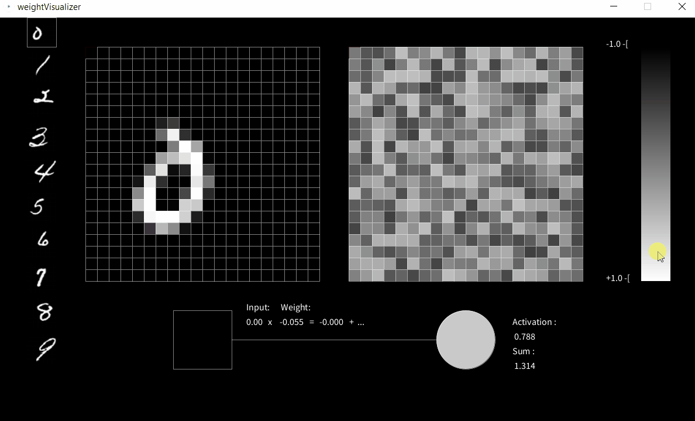

# manual-perceptron
An interactive handout to accompany discussions about Neural Networks. The "frightening idea" comes from a short remark in a 3Blue1Brown video. The point is to get a sense for how the weights must be set to correctly catch different instances of the same digit and not others. It is not ever intended to be actually completed, it is definitely more intended to foster discusions about generalizations, data and bias.